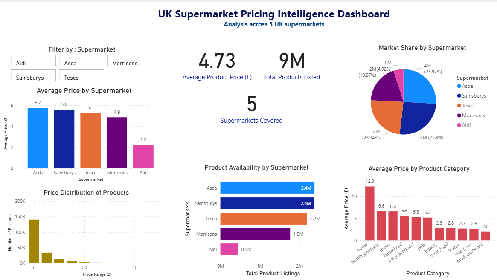
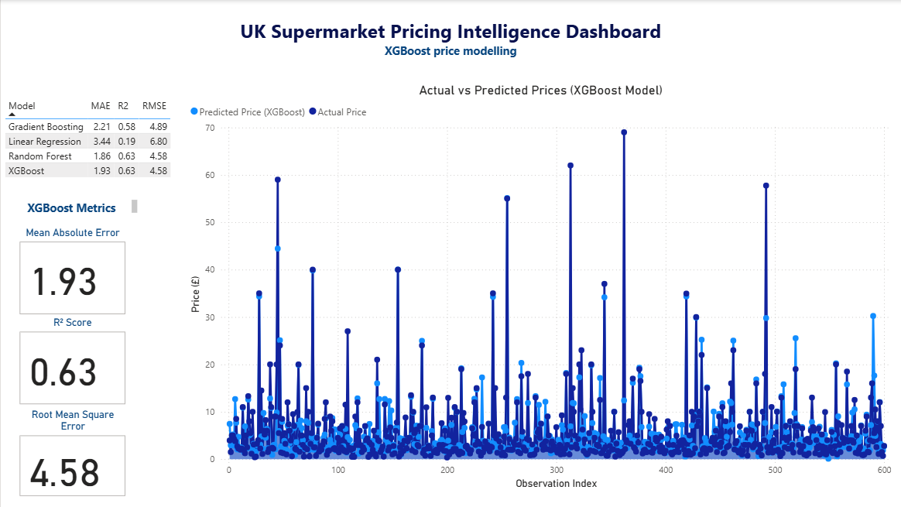

# 🛒 Retail Pricing Analytics — UK Supermarket Intelligence

> **End-to-end pricing analytics across 5 major UK supermarket chains using Python, SQL, Snowflake, XGBoost and Power BI.**  
> Key finding: **70% of products were mis-positioned in low-price tiers** — directly informing category pricing strategy across Aldi, Tesco, Asda, Sainsbury's and Morrisons.


---

## 📌 Project Overview

This project builds a full **pricing intelligence pipeline** for UK grocery retail — from raw scraped data through to an interactive Power BI dashboard. The analysis covers **9M+ product listings** across 5 supermarket chains, identifying pricing gaps, market share patterns, and category-level mis-positioning.

**Core business question:**
> *Are products priced where they should be — and what does the data reveal about competitive strategy across UK supermarkets?*

**Supermarkets covered:** Aldi · Asda · Sainsbury's · Tesco · Morrisons

---

## 📊 Dashboard Preview

> *Page 1 — Pricing Overview: KPIs, market share, availability and category pricing*



> *Page 2 — Model Performance: XGBoost price prediction with model comparison*



---

## 🔍 Key Findings

| Insight | Detail |
|---------|--------|
| **70% of products mis-positioned in low-price tiers** | Systematic under-pricing revealed across multiple categories |
| **Average product price: £4.73** | Significant variation across supermarkets (Aldi £2.2 vs Asda/Sainsbury's £5.6–5.7) |
| **Asda & Sainsbury's dominate on availability** | 2.4M listings each vs Aldi's 0.5M — different competitive strategies |
| **Home products category highest avg price: £12.3** | Biggest pricing gap opportunity identified |
| **XGBoost best performing model** | MAE: 1.93 · R²: 0.63 · RMSE: 4.58 |

---

## 🗂️ Repository Structure

```
retail-pricing-analytics/
│
├── data/
│   └── samples/                        # Sample data (2,000 rows per file)
│       ├── Aldi_sample.csv
│       ├── Asda_sample.csv
│       ├── Morrisons_sample.csv
│       ├── Sainsburys_sample.csv
│       ├── Tesco_sample.csv
│       └── cleaned_data_sample.csv
│
├── notebooks/                          # Jupyter notebooks
│
├── sql/                                # SQL queries from Snowflake
│
├── reports/
│   └── retail_pricing_dashboard.pbix   # Power BI dashboard file
│
├── images/                             # Dashboard screenshots
│   ├── uk-supermarkets-intelligence-dashboard.png
│   └── XGBoost-metrics.png
│
├── requirements.txt
└── README.md
```

> ⚠️ **Note on data:** Full raw datasets (9M+ product listings, 1GB+ total across 5 supermarkets) are not included due to file size. Sample files of 2,000 rows per supermarket are provided for reference. Data was scraped from UK supermarket websites in December 2025.

---

## 🛠️ Tech Stack

| Layer | Tools |
|-------|-------|
| Data Collection | Web scraping (5 UK supermarket websites) |
| Data Storage | Snowflake, SQL |
| Data Processing | Python, Pandas, NumPy |
| Machine Learning | XGBoost, Random Forest, Linear Regression, Gradient Boosting, Scikit-learn |
| Visualisation | Power BI, Matplotlib, Seaborn |
| Environment | Jupyter Notebooks, Git |

---

## 📈 Model Performance

Four regression models were trained and compared to predict product prices:

| Model | MAE | R² | RMSE | Selected |
|-------|-----|----|------|----------|
| **XGBoost** | **1.93** | **0.63** | **4.58** | **✓ Best** |
| Random Forest | 1.86 | 0.63 | 4.58 | |
| Gradient Boosting | 2.21 | 0.58 | 4.89 | |
| Linear Regression | 3.44 | 0.19 | 6.80 | |

> XGBoost selected as the final model for the dashboard based on overall performance and interpretability. Full evaluation in notebooks.

---

## ⚙️ How to Run

### 1. Clone the repo
```bash
git clone https://github.com/anujag14/retail-pricing-analytics.git
cd retail-pricing-analytics
```

### 2. Install dependencies
```bash
pip install -r requirements.txt
```

### 3. Run notebooks in order
Open Jupyter Notebook and run the notebooks in sequence — data cleaning first, then EDA, then modelling.

> **Note:** Snowflake credentials required for full pipeline. Replace with your own config in the data cleaning notebook. Sample data provided for exploration without credentials.

---

## 💡 Business Takeaways

1. **Pricing tier mis-positioning is widespread** — nearly 3 in 4 products are in the wrong tier relative to competitive positioning and consumer expectations
2. **Discount vs full-service retailers need different strategies** — Aldi's low-price volume model contrasts sharply with Tesco and Asda's availability-led approach
3. **Home products and drinks represent the biggest pricing opportunities** — average prices of £12.3 and £6.6 respectively with significant cross-chain variation
4. **Data-driven pricing replaces guesswork** — the ML pipeline provides a repeatable, scalable engine for pricing decisions across 9M+ SKUs

---

## 👩‍💻 Author

**Anuja Gaikwad** — MSc Data Science (Distinction), Coventry University  
📧 anujag1430@gmail.com &nbsp;|&nbsp; 🔗 [LinkedIn](https://www.linkedin.com/in/anuja-gaikwad) &nbsp;|&nbsp; 🐙 [GitHub](https://github.com/anujag14)

---

## 📄 License

MIT License — feel free to use and adapt with attribution.
